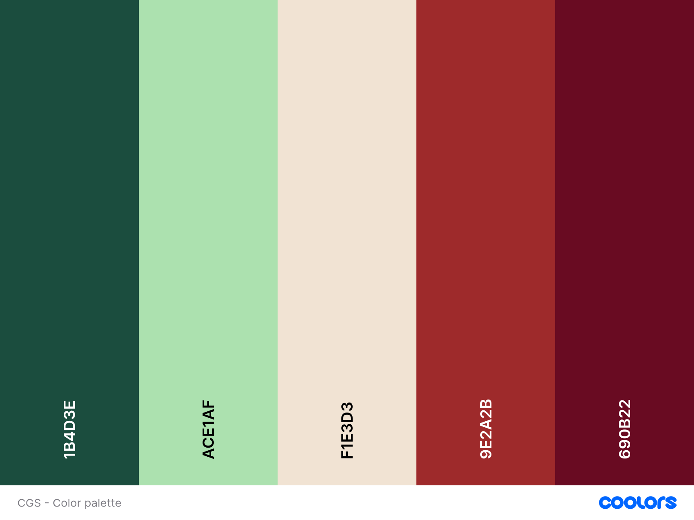
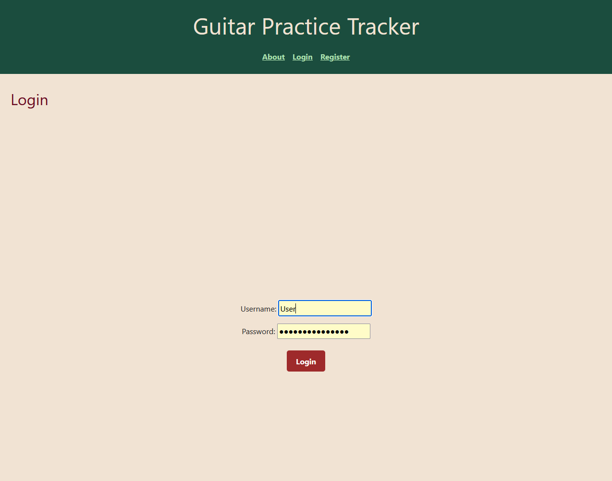

# GUITAR PRACTICE TRACKER

**Developer: Damian Droste**

💻 [Visit live website](https://guitar-practice-tracker-6ddb606e64f7.herokuapp.com)  
(Ctrl + click to open in new tab)

## Table of Contents
  - [About](#about)
  - [User Goals](#user-goals)
  - [Site Owner Goals](#site-owner-goals)
  - [User Experience](#user-experience)
  - [User Stories](#user-stories)
  - [Design](#design)
    - [Colours](#colours)
    - [Fonts](#fonts)
    - [Structure](#structure)
      - [Website pages](#website-pages)
      - [Database](#database)
    - [Wireframes](#wireframes)
  - [Technologies Used](#technologies-used)
  - [Features](#features)
  - [Validation](#validation)
  - [Testing](#testing)
    - [Manual testing](#manual-testing)
    - [Automated testing](#automated-testing)
    - [Tests on various devices](#tests-on-various-devices)
    - [Browser compatibility](#browser-compatibility)
  - [Bugs](#bugs)
  - [Heroku Deployment](#heroku-deployment)
  - [Credits](#credits)
  - [Acknowledgements](#acknowledgements)

### 📋 About
The Guitar Practice Tracker is a web application designed to help guitarists set,
track, and achieve practice goals efficiently. It supports both custom and standard 
goals and provides detailed session logging, progress tracking, and user profile management.

### User Goals

- Set and Manage Goals:
	Users aim to set personal goals for different practice types—such as technique, routine, or repertoire—and break them into measurable targets.
- Log Practice Sessions Easily:
	Users want a clean, efficient interface to quickly log their daily or weekly practice sessions, optionally linking them to goals.
- Customize or Use Predefined Goals:
	Users should be able to either define their own goals or select from a curated list of standard goals for guidance.
- Upload practice recordings to compare their performances over time

### Site Owner Goals

- Offer a Valuable Learning Tool for Musicians:
	Provide a focused app that supports musical development through structured, goal-based practice.
- Ensure Secure, Personalized User Experience:
	Maintain account-based data with authentication, profile customization, and user-specific goal/session management.
- Promote Best Practices in Practice Planning:
	Help users understand and apply structured practice methods like routine scheduling and measurable targets.
- Provide Admin Tools for Goal Curation:
	Enable site admins to define standard goal templates that users can select and autofill into their own plans.
- Ensure Accessibility and Responsiveness:
	Deliver a clean, mobile-friendly UI that is usable and visually accessible across devices and screen sizes.

## User Experience

### 🎯 Target Audience

- Guitarists of all skill levels who want to track their practice progress over time
- Students following a structured practice routine provided by a teacher or school
- Hobbyists who want to balance structured and creative practice
- Musicians preparing for performances, auditions, or recordings
- Anyone who enjoys goal-setting and wants to quantify their musical development

### User Requirements and Expectations

- Fully Responsive Design:
	The app must work seamlessly across desktops, tablets, and mobile devices so users can log sessions on the go.
- Accessibility:
	Clear contrast, readable fonts, and keyboard navigability ensure users with different abilities can interact with the app easily.
- Welcoming, Minimalist Design:
	Users expect a clutter-free interface that supports concentration and gives priority to functionality.
- Social & Support Links:
	Easy access to support or feedback forms, as well as links to relevant communities or help pages, adds to user trust.
- Clear Contact and Account Info:
	Users want to easily manage their profiles, see their progress, and optionally delete their data securely.
- Progress Visualization:
	Visual feedback like progress bars and session history boosts motivation and helps users stay committed.

##### Back to [top](#table-of-contents)

## User Stories

### Site Users

1. 	I want to create a personal user account so I can track my practice goals and sessions securely.

2. 	I want to log into my account so I can access my private dashboard and practice data. 

3. 	I want to log out easily so I can ensure my data is not accessible to others.

4. 	I want to navigate the site freely and explore all the features

5. 	I want to view an overview of my goals on the dashboard so I can stay focused on my current practice priorities.

6. 	I want to create a new goal so I can stay focused on my current practice priorities.

7. 	I want to select a goal type so I can define what I want to work on

8. 	I want to autofill a goal from a predefined list of standard goals so the app tailors the required input fields accordingly

9. 	I want to log a practice session so I can track the time I’ve spent and key metrics 

10. I want the session form to adjust to the selected goal type so irrelevant input fields are hidden

11. I want to view a list of all my past practice sessions so I can reflect on what I’ve done so far.

12. I want to link sessions to a specific goal so I can see my work in the context of a particular objective.

13.	I want to edit a goal or a session after creating it so I can fix mistakes or adjust targets.

14. I want to delete goals and sessions so I can clean up outdated or irrelevant data.

15.	I want to see my profile and update basic details like username and email so I stay in control of my account.

16. I want to upload or change a profile picture so my account feels more personal.

17. I want to delete my account so I can remove my data completely if I no longer want to use the app.

### Admin / Authorised User

18. I want to create and manage standard goal definitions so users have access to pre-built, structured goal templates.

19.	I want to view all registered users through the Django admin panel so I can monitor usage and manage inappropriate or inactive accounts.

20. I want to make certain fields required or optional at the model level so data integrity is preserved throughout the app.

21.	I want to test all user flows and forms directly in the admin panel so I can quickly identify and resolve edge cases or bugs.

### Site Owner/ Project Maintainer

22.	I want to deploy the project in a maintainable and scalable way so it can be hosted on a platform like Heroku or Render with minimal downtime.

23. I want to structure the code with reusable components so future features like progress charts or notifications can be added easily.

24. I want to include documentation (like this README) so other developers can understand and contribute to the project easily.

25. I want to integrate basic accessibility and responsive design best practices so the app is usable across devices and for users with diverse needs.  

26. As a Site Owner I can edit data entered into my site so that all submitted data is maintained to avoid errors

### Kanban, Epics & User Stories
- GitHub was used to track all open user stories
- Epics were created using the milestones feature
- Backlog, In Progress, Done headings were used in a board

Epics

Epic 7 closed items:

Epic 7 open items:

Epic 8 for future plans:

User stories:

View of the Board:

## Design

### Colours

I chose warm and and vintage colours while maintaining a modern design. I wanted the app to look like a modern offspring of my custom guitar shop which uses the same colour palette. 

The colors I wanted to stay close to  [Coolors.co](https://coolors.co/)

    
See colour pallet

    

### Fonts

 The fonts i specified as --font-sans: 'Segoe UI', Tahoma, Geneva, Verdana, sans-serif in this. I wantend sans-serifs, because they ensure readability and since the app can at some point include a plethora of information, I wanted to make sure that the font is readable even when it gets 'crowded'.

### Structure

#### Page flow

The basic site is designed as clean as possible with a Clean header containing the app name and the navbar, a footer with a signature and social media links and the main content, which is subject to change while navigation through the app.

- home page
This is the first entrance page it features a simple welcome and is basically just a provider for further navigation, if the user is not logge in yet it will provide three options, about, register and login;

- about page
nothing fancy, just a short descriptive text about the app and its purpose

- login page
straightforward login page to fill in your credentials and enter the user space

- register page
this page is for new users who need to create an account first after creating their account they will be redirected to the dashboard

- profile page
users can alway edit their data provide additional info and change their passwort on this page

- dashboard
this is the page that lists all goals and practice sessions by the user, it also provides the option to create them

-goal_form
if you want to create a goal you will be asked to put the goal specifics on this page and save

-goal_detail
if you created a goal or clicked a goal from your list, this page provides you with a detail view of your goal. It will also feature all sessions linked to that goal.

-session_form
if you want to create a practice session you will be asked to put the specifics on this page and save

-session_detail
if you created a practice session or clicked a it from your list on the dashboard, this page provides you with a detail view.

#### Database

- The DB s created with Python and the Django framework and connects to a Postgres instance provided by Code Institute for the deployed Heroku version(production)
- Below find a diagramm showing all the models and connections

Show diagram

##### Models

###### CustomUser (inherits from AbstractUser, only relevant fields are noted here)
| Field Name | Field Type | Notes |
|---|---|---|
| id| id | automatically created (from AbstractUser) |
| photo | Image Field | Optional. Uploaded to MEDIA_ROOT/user_images/<username> |
|| username | Required. Unique. Used for authentication. (from AbstractUser) |
|| password | Hashed password field. Required. |
|| email | Optional. (from AbstractUser) |
|| first_name | Optional. (from AbstractUser) |
|| last_name | Optional. (from AbstractUser) |

###### StandardGoalDefinition
| Field Name | Field Type | Notes |
|---|---|---|
| user| ForeignKey | Links to CustomUser. On delete, all related goals are also deleted. |
| title | Charfield | Required. Max length: 100. |
| description | TextField | Optional. Can contain long, formatted text about the goal. |
| goal_type | CharField | Choice of 'technique', 'repertoire', 'routine', 'custom'. |

###### Goal
| Field Name | Field Type | Notes |
|---|---|---|
| user| ForeignKey | Links to CustomUser. On delete, all related goals are also deleted. |
| title | Charfield | Required. Max length: 100. |
| description | TextField | Optional. Can contain long, formatted text about the goal. |
| goal_type | CharField | Choice of 'technique', 'repertoire', 'routine', 'custom'. |
| standard_goal | ForeignKey | Optional. Links to StandardGoalDefinition. Null if custom goal. |
| goal | ForeignKey (self) | Optional self-referencing field to allow subgoals in future.|
| target_tempo | PositiveIntegerField | Optional. Relevant for technique/custom. Target tempo in BPM.|
|target_accuracy | FloatField | Optional. Percentage value (e.g., 95.0 = 95%). Relevant for technique/custom. |
target_duration | PositiveIntegerField | Optional. Target total minutes of practice (e.g., 600 minutes). |
| routine_target_days | PositiveIntegerField | Optional. For routine goals: how many consecutive days define "success" (e.g., 7) will be used for future streak achievements. |
| created_at | DateTimeField | Auto-set to current date/time when the goal is created. |
| target_date | DateField | Optional. The date by which the user wants to complete the goal. |

###### PracticeSession
| Field Name | Field Type | Notes |
|---|---|---|
| user| ForeignKey | Links to CustomUser. On delete, all related sessions are also deleted. |
| goal | ForeignKey |Optional. Links to a Goal. Null if not tied to a specific goal.|
| date | DateTimeField | Defaults to the moments of session creation |
| tempo | PositiveIntegerField | Optional. Relevant for technique/custom. Target tempo in BPM.|
| accuracy | FloatField | Optional. Percentage value (e.g., 95.0 = 95%). Relevant for technique/custom goals. |
| duration | PositiveIntegerField | Optional. Target total minutes of practice . |
| notes | TextField | Optional. Freeform user notes about the session. |

##### Summary of Foreign Keys & Relationships
| Relationship | Source Model | Target Model | Notes |
|---|---|---|--|
| user → goals | Goal | CustomUser | One user can have many goals |
|standard_goal → name | Goal | StandardGoalDefinition | Used to preload common goals |
|goal → subgoals | Goal | Goal (self) |	A goal can have subgoals (e.g. "Master Scales" → "Major Scale") |
|goal → sessions | PracticeSession | Goal | A goal can have many practice sessions |
|user → sessions | PracticeSession | CustomUser | Each user can log many practice sessions |

### Wireframes
The wireframes were created using Balsamiq

## Technologies Used

### Languages & Frameworks

- HTML
- CSS
- Javascript
- Python
- Django

### Libraries & Tools

- [Am I Responsive](http://ami.responsivedesign.is/)
- [Balsamiq](https://balsamiq.com/)
- [Bootstrap v5.2](https://getbootstrap.com/)
- [Cloudinary](https://cloudinary.com/)
- [Favicon.io](https://favicon.io)
- [Chrome dev tools](https://developers.google.com/web/tools/chrome-devtools/)
- [Font Awesome](https://fontawesome.com/)
- [Git](https://git-scm.com/)
- [GitHub](https://github.com/)
- [Heroku Platform](https://id.heroku.com/login)
- [Postgres](https://www.postgresql.org/)
- Validation:
  - [WC3 Validator](https://validator.w3.org/)
  - [Jigsaw W3 Validator](https://jigsaw.w3.org/css-validator/)
  - [JShint](https://jshint.com/)
  - [Flake8](https://flake8.pycqa.org/)
  - [Lighthouse](https://developers.google.com/web/tools/lighthouse/)
  - [Wave Validator](https://wave.webaim.org/)

##### Back to [top](#table-of-contents)

## Features

### Navigation & Layout
    Responsive layout for desktop and mobile
    Top navigation bar with links rendering based on authentication status:

        Home  - via app name (always)

        About - via Navbar (always)

        Dashboard - via Navbar (if logged in)

        Profile - via Navbar, shows username (if logged in)

        Login / Logout - via Navbar changes with authentication status

        Register - via Navbar (if logged out)
    

Screenshots

### Sticky footer with:

    - Social media icons

    - signature info and project name

    - Mobile-friendly layout

Screenshots

### Page Styling

    - Global styling using CSS variables and custom palette

    - Messages framework support for user feedback

Screenshots

### User Features

    User registration with username, email, password

Screenshots

    User authentication (login/logout)

Screenshots

    User profile page:

        - View & edit username/email
        - Upload/change profile picture
        - Change password
        - Delete account with confirmation

Screenshots

Goal Management

    Create a goal (custom or based on standard templates)

    Goal types:

        - Technique
        - Repertoire
        - Routine
        - Custom

    Dynamic goal form UI:

        Fields change based on selected goal type

Screenshots

    Standard goal selection:

        Autofill title & description via AJAX

        Filtered dropdown based on selected goal type

Screenshots

    Edit goals:

        Update fields post-creation

    Delete goals:

        With user confirmation

Screenshots

    Optional target metrics:

        - Tempo, accuracy, duration (for technique/custom)
        - Target date

Screenshots

    Goal detail page:

        - Metadata: type, description, target date
        - Linked sessions
        - log a session for that goal

Screenshots

Practice Session Management

    Create session (linked or unlinked to goal)

    Session fields:

        - Date & time
        - Duration (min)
        - Tempo (BPM)
        - Accuracy (%)
        - Notes

Screenshots

    Dynamic form logic:

        Shows/hides tempo/accuracy depending on goal type

Screenshots

    Edit & delete practice sessions

Screenshots

📊 Dashboard & Goal Detail View

    Dashboard for authenticated users:

        List of active goals

Screenshots

        View list of past sessions

Screenshots

        View sessions linked to specific goal

Screenshots

🔐 Security & Validation

    CSRF protection for all forms

    Password hashing via Django auth

    Form field validation:

        Custom form logic for goal type-specific required fields

Screenshots

    Email & username uniqueness enforced

Screenshots

    Image upload security via Pillow

🛠️ Admin Features

    Access to Django admin interface

    Manage:

        - Users
        - Goals
        - Practice Sessions
        - Standard Goal Templates

Screenshots

## Validation

### HTML Validation (W3C)

### HTML-validation

[HTML W3C Validator](https://validator.w3.org) was used to validate html pages I am not providing aspecific Url, since the site is not static:

| Directory | File | Screenshot |
|---|---|---|
| accounts\templates\accounts\login.html | [login](https://github.com/n4v1ds0n/guitar-practice-tracker/blob/main/accounts/templates/accounts/login.html) |  |
| accounts\templates\accounts\profile.html | [profile](https://github.com/n4v1ds0n/guitar-practice-tracker/blob/main/accounts/templates/accounts/profile.html) |  |
| accounts\templates\accounts\register.html | [register](https://github.com/n4v1ds0n/guitar-practice-tracker/blob/main/accounts/templates/accounts/register.html) |  |
| practice\templates\practice\about.html | [about](https://github.com/n4v1ds0n/guitar-practice-tracker/blob/main/practice/templates/practice/about.html) |  |
| practice\templates\practice\dashboard.html |[dashboard](https://github.com/n4v1ds0n/guitar-practice-tracker/blob/main/practice/templates/practice/dashboard.html) |  |
| practice\templates\practice\goal_detail.html |[goal_detail](https://github.com/n4v1ds0n/guitar-practice-tracker/blob/main/practice/templates/practice/goal_detail.html) |  |
| practice\templates\practice\goal_form.html |[goal_form](https://github.com/n4v1ds0n/guitar-practice-tracker/blob/main/practice/templates/practice/goal_form.html) |  |
| practice\templates\practice\home.html |[home](https://github.com/n4v1ds0n/guitar-practice-tracker/blob/main/practice/templates/practice/home.html) |  |
| practice\templates\practice\session_detail.html |[session_detail](https://github.com/n4v1ds0n/guitar-practice-tracker/blob/main/practice/templates/practice/session_detail.html) |  |
| practice\templates\practice\session_form.html |[session_form](https://github.com/n4v1ds0n/guitar-practice-tracker/blob/main/practice/templates/practice/session_form.html) |  |

### CSS-validation

[CSS Jigsaw Validator](https://jigsaw.w3.org/css-validator) was used to validate the custom stylesheet.

| Directory | File | Screenshot |
| --- | --- | --- |
| static\css\style.css | [style.css](https://github.com/n4v1ds0n/guitar-practice-tracker/blob/main/static/css/style.css) |  |

### JShint

[JShint Validator](https://jshint.com/) was used to validate JavaScript scripts.

| Directory | File | Screenshot |
| --- | --- | --- |
| static\js\goal_form.js | [goal_form.js](https://github.com/n4v1ds0n/guitar-practice-tracker/blob/main/static/js/goal_form.js) |  |
| static\js\session_form.js | [session_form.js](https://github.com/n4v1ds0n/guitar-practice-tracker/blob/main/static/js/session_form.js) |  |

### Validator Testing

- **PEP8** compliance ensured using flake8 extension for VScode

## Accessibility

| Page | File | Screenshot |
| --- | --- | --- |
| accounts\templates\accounts\login.html | [login](https://github.com/n4v1ds0n/guitar-practice-tracker/blob/main/accounts/templates/accounts/login.html) |  |
| accounts\templates\accounts\profile.html | [profile](https://github.com/n4v1ds0n/guitar-practice-tracker/blob/main/accounts/templates/accounts/profile.html) |  |
| accounts\templates\accounts\register.html | [register](https://github.com/n4v1ds0n/guitar-practice-tracker/blob/main/accounts/templates/accounts/register.html) |  |
| practice\templates\practice\about.html | [about](https://github.com/n4v1ds0n/guitar-practice-tracker/blob/main/practice/templates/practice/about.html) |  |
| practice\templates\practice\dashboard.html |[dashboard](https://github.com/n4v1ds0n/guitar-practice-tracker/blob/main/practice/templates/practice/dashboard.html) |  |
| practice\templates\practice\goal_detail.html |[goal_detail](https://github.com/n4v1ds0n/guitar-practice-tracker/blob/main/practice/templates/practice/goal_detail.html) |  |
| practice\templates\practice\goal_form.html |[goal_form](https://github.com/n4v1ds0n/guitar-practice-tracker/blob/main/practice/templates/practice/goal_form.html) |  |
| practice\templates\practice\home.html |[home](https://github.com/n4v1ds0n/guitar-practice-tracker/blob/main/practice/templates/practice/home.html) |  |
| practice\templates\practice\session_detail.html |[session_detail](https://github.com/n4v1ds0n/guitar-practice-tracker/blob/main/practice/templates/practice/session_detail.html) |  |
| practice\templates\practice\session_form.html |[session_form](https://github.com/n4v1ds0n/guitar-practice-tracker/blob/main/practice/templates/practice/session_form.html) |  |

## Performance

| Page | File | Screenshot |
| --- | --- | --- |
| accounts\templates\accounts\login.html | [login](https://github.com/n4v1ds0n/guitar-practice-tracker/blob/main/accounts/templates/accounts/login.html) |  |
| accounts\templates\accounts\profile.html | [profile](https://github.com/n4v1ds0n/guitar-practice-tracker/blob/main/accounts/templates/accounts/profile.html) |  |
| accounts\templates\accounts\register.html | [register](https://github.com/n4v1ds0n/guitar-practice-tracker/blob/main/accounts/templates/accounts/register.html) |  |
| practice\templates\practice\about.html | [about](https://github.com/n4v1ds0n/guitar-practice-tracker/blob/main/practice/templates/practice/about.html) |  |
| practice\templates\practice\dashboard.html |[dashboard](https://github.com/n4v1ds0n/guitar-practice-tracker/blob/main/practice/templates/practice/dashboard.html) |  |
| practice\templates\practice\goal_detail.html |[goal_detail](https://github.com/n4v1ds0n/guitar-practice-tracker/blob/main/practice/templates/practice/goal_detail.html) |  |
| practice\templates\practice\goal_form.html |[goal_form](https://github.com/n4v1ds0n/guitar-practice-tracker/blob/main/practice/templates/practice/goal_form.html) |  |
| practice\templates\practice\home.html |[home](https://github.com/n4v1ds0n/guitar-practice-tracker/blob/main/practice/templates/practice/home.html) |  |
| practice\templates\practice\session_detail.html |[session_detail](https://github.com/n4v1ds0n/guitar-practice-tracker/blob/main/practice/templates/practice/session_detail.html) |  |
| practice\templates\practice\session_form.html |[session_form](https://github.com/n4v1ds0n/guitar-practice-tracker/blob/main/practice/templates/practice/session_form.html) |  |

## Testing

### Manual testing

1. 	I want to create a personal user account so I can track my practice goals and sessions securely.

| **Feature** | **Action** | **Expected Result** | **Actual Result** |
|-------------|------------|---------------------|-------------------|
| register  | On home page, click register, enter credentials | get redirected to users neew dashboard | Works as expected |

Screenshots

2. 	I want to log into my account so I can access my private dashboard and practice data. 

| **Feature** | **Action** | **Expected Result** | **Actual Result** |
|-------------|------------|---------------------|-------------------|
| login  | On home page, click login, enter credentials | get redirected to users dashboard | Works as expected |

Screenshots

3. 	I want to log out easily so I can ensure my data is not accessible to others.

| **Feature** | **Action** | **Expected Result** | **Actual Result** |
|-------------|------------|---------------------|-------------------|
| logout  | While logged in, click logout | get redirected home page | Works as expected |

Screenshots

4. 	I want to navigate the site freely and explore all the features

| **Feature** | **Action** | **Expected Result** | **Actual Result** |
|-------------|------------|---------------------|-------------------|
| navbar  | use the navbar to navigate between pages | get to all pages | Works as expected |

Screenshots

5. 	I want to view an overview of my goals on the dashboard so I can stay focused on my current practice priorities.

| **Feature** | **Action** | **Expected Result** | **Actual Result** |
|-------------|------------|---------------------|-------------------|
| dashboard  | go to dashboard | see list of goals that have been created | Works as expected |

Screenshots

6. 	I want to create a new goal so I can stay focused on my current practice priorities.

| **Feature** | **Action** | **Expected Result** | **Actual Result** |
|-------------|------------|---------------------|-------------------|
| dashboard  | go to dashboard | see list of goals that have been created | Works as expected |

Screenshots

7. 	I want to select a goal type so I can define what I want to work on

8. 	I want to autofill a goal from a predefined list of standard goals so the app tailors the required input fields accordingly

9. 	I want to log a practice session so I can track the time I’ve spent and key metrics 

10. 	I want the session form to adjust to the selected goal type so irrelevant input fields are hidden

11. 	I want to view a list of all my past practice sessions so I can reflect on what I’ve done so far.

12. 	I want to link sessions to a specific goal so I can see my work in the context of a particular objective.

13.	I want to edit a goal or a session after creating it so I can fix mistakes or adjust targets.

14. 	I want to delete goals and sessions so I can clean up outdated or irrelevant data.

15.	I want to see my profile and update basic details like username and email so I stay in control of my account.

16. 	I want to upload or change a profile picture so my account feels more personal.

17. 	I want to delete my account so I can remove my data completely if I no longer want to use the app.

### Admin / Authorised User

18. 	I want to create and manage standard goal definitions so users have access to pre-built, structured goal templates.

19.	I want to view all registered users through the Django admin panel so I can monitor usage and manage inappropriate or inactive accounts.

20. 	I want to make certain fields required or optional at the model level so data integrity is preserved throughout the app.

21.	I want to test all user flows and forms directly in the admin panel so I can quickly identify and resolve edge cases or bugs.

### Site Owner/ Project Maintainer

22.	I want to deploy the project in a maintainable and scalable way so it can be hosted on a platform like Heroku or Render with minimal downtime.

23. 	I want to structure the code with reusable components so future features like progress charts or notifications can be added easily.

24. 	I want to include documentation (like this README) so other developers can understand and contribute to the project easily.

25. 	I want to integrate basic accessibility and responsive design best practices so the app is usable across devices and for users with diverse needs.  

26. 	As a Site Owner I can edit data entered into my site so that all submitted data is maintained to avoid errors

### Performing tests on various devices
The pages were testet on:
- Desktop pc
- Samsung Galaxy A52
- Samsung Galaxy A53
- Kindle fire tablet 7

### Browser compatibility

- Mozilla Firefox
- Google Chrome
- Microsoft Edge

## Deployment

Deployed to [Heroku](https://heroku.com) using Code Institute’s Python Essentials terminal template.

**Steps to deploy:**
1. Create a Heroku account (if not already existing)
2. Create a new app with Heroku

Screenshots

4. Allowing Heroku access to GitHub, link the new app to the relevant repository

Screenshots

5. Choose whether or not to enable Automatic Deploys. If enabled, the deployed app will update automatically with each push to GitHub

Screenshots

6. Click Deploy